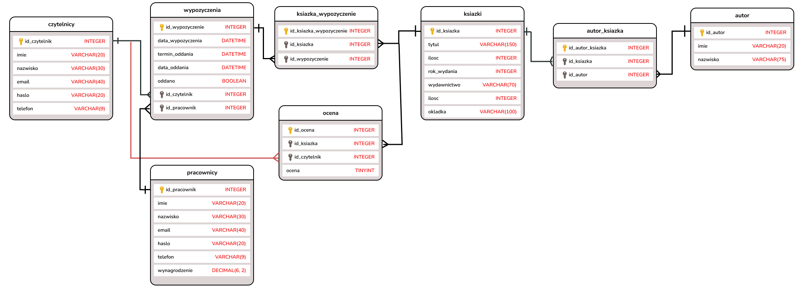

# Projekt zaliczeniowy z przedmiotu: _**Aplikacje internetowe**_

# Temat projektu: 
## Skład grupy: 
- Łukasz Flisak
- Michał Kornak
- Kamil Grocholski
## Specyfikacja projektu
### Cel projektu:
#### Cele szczegółowe:
   1. cel 1
   2. cel 2
   3. ...
### Funkcjonalności:
   - [X] logowanie i rejestracja
   - [X] panel admina
   - [ ] wypożyczanie książek
   - [ ] przeglądanie historii wypożyczeń
   - [ ] filtrowanie książek po tytule/autorach
   - [X] możliwość eksportowania i importowania danych do bazy
   - [ ] oceny [może]
### Interfejs serwisu

   <details>
       <summary>Ekran główny </summary>
	
![alt text][logo]

           <p>Przedstawiono ...</p>
   </details>
	<details>
       <summary>Ekran ...</summary>

![alt text][logo]
           <p>Czego dotyczy?</p>
   </details>
         
### Baza danych
####	Diagram ERD

####	Skrypt do utworzenia struktury bazy danych
Skrypt znajduje się w folderze **mariadb/init**.

## Wykorzystane technologie

## Proces uruchomienia aplikacji (krok po kroku)
### Windows (polecenie trzeba zmodyfikować)
Dla systemu Windows wystarczy stworzyć link w folderze *htdocs*
1. Uruchom CMD jako administrator i przejdź do katalogu z repozytorium
1. Uruchom następujące polecenie:
```
mklink /J c:\xampp\htdocs\src src
```

Następnie uruchom XAMPP'a i wejdź pod ten adres [Sprawdź](http://localhost/).
### Docker
Wystarczą tylko 2 polecenia:
```
export UID=$(id -u) && export GID=$(id -g)
docker-compose up
```

[Strona główna](http://localhost:8000)

[phpMyAdmin](http://localhost:8080)


### Potrzebne nazwy użytkowników do uruchomienia aplikacji


[Przydatny link przy tworzeniu plików *.md ](https://github.com/adam-p/markdown-here/wiki/Markdown-Cheatsheet)
